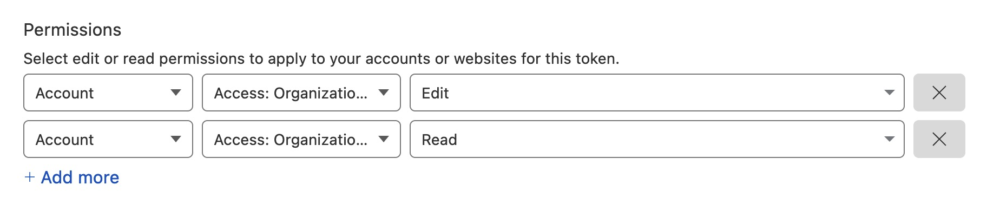
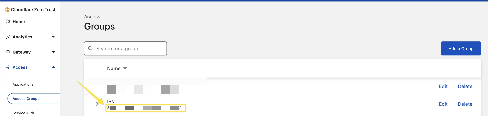

# cloudflare-access-group-ip-updater

## Problem Description

- Service behind zerotrust who need to access other services
- Cannot use Cloudflare service auth built-in functionality
- The Public IP is changing (not static) (ex: your home public IP)

## Description

The goal of this script to auto update a public IP address that you use in a Cloudflare ZeroTrust Access Group. I guess you can also do it with a Workers, but it was easier for me in bash ✌️

## Requirements

- curl and jq

```bash
# mac
$ brew install jq curl
# linux
$ sudo apt install jq curl
```

- Cloudflare [Account ID](https://developers.cloudflare.com/fundamentals/get-started/basic-tasks/find-account-and-zone-ids/).
- Access Group UID (zerotrust section).
- [Api Token](https://developers.cloudflare.com/fundamentals/api/get-started/create-token/) with read and edit on "Access: Identity Providers and Groups" in your Account.





## How to use

- git clone
- change the 3 variables in the first line of the script
- make sure it works
- setup a cron (optional)
